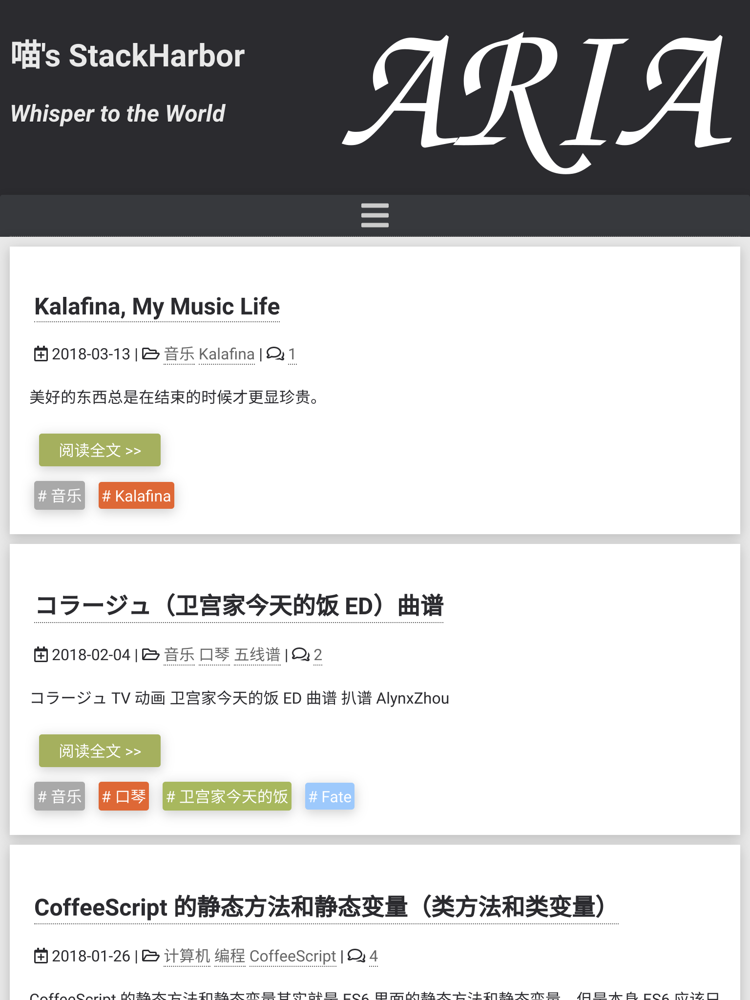
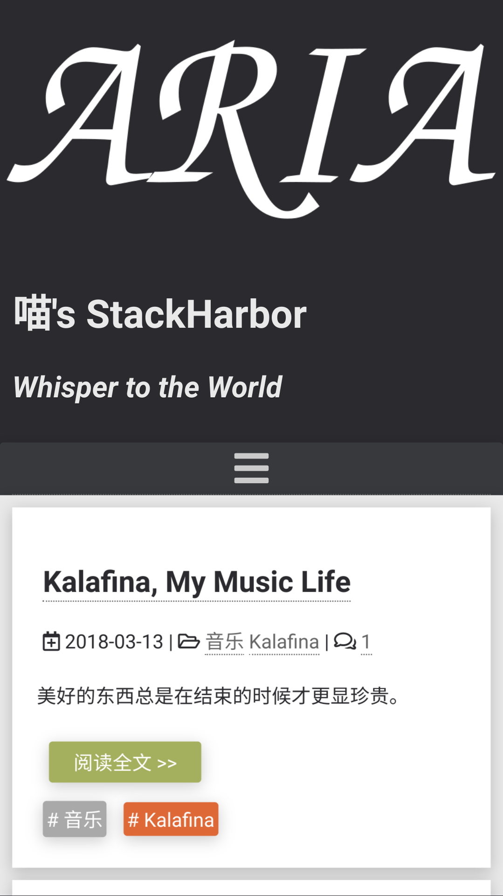

hexo-theme-aria
===============

Live Demo: [喵's StackHarbor](https://sh.alynx.xyz/)






# HELP NEEDED!

This theme makes full use of CSS3 features such as FlexBox and CSS Animation that may not work in some old broswers (like IE 6-11), however I am not a professional frontend developer, compared with CSS I am more familier with JavaScript and Node, I don't know how to make them work in old broswers and I am lazy and don't know how to add css prefix automatically and elegantly. So if you can help with them please send PRs! Thanks!

# Feature:

  - Responsive double column layout with css animation
  - Comment system (currently only supprt [HyperComments](https://www.hypercomments.com/) and [Disqus](https://disqus.com/)).
  - Busuanzi counting.
  - Hexo local search support (need to install `hexo-generator-search` and set config as its [README](https://github.com/PaicHyperionDev/hexo-generator-search)).
  - Multi-languages support (currently zh_CN and en, PR welcome).
  - Image display powered by [lightgallery](https://sachinchoolur.github.io/lightgallery.js/)
  - RSS supported (need to install `hexo-generator-feed` and set config as its [README](https://github.com/hexojs/hexo-generator-feed)).

# Usage:

  1. Run `npm install --save hexo-renderer-nunjucks hexo-generator-search hexo-generator-feed`.
  2. `git clone https://github.com/AlynxZhou/hexo-theme-aria.git themes/aria`.
  3. Change your Hexo site config `_config.yml`, like following:

  ```yaml
  # Replace theme to aria
  theme: aria
  # Hexo localsearch
  search:
    path: search.xml
    field: all
  # Hexo generator feed
  feed:
    type: atom
    path: atom.xml
    limit: 20
    hub:
    content:
    content_limit: 140
    content_limit_delim: ' '
  ```

  4. Copy `themes/aria/_config.yml.example` to `themes/aria/_config.yml`, then edit `themes/aria/_config.yml` to what you want.
  5. If you want comment in one page, add `comment: true` to the page's source file. If you want Hexo add it automatically when creating a new page, add it to Hexo markdown templates in `scaffolds/` folder.

# TODO:

  - More functions
  - Docs

# LICENSE:

  Apache-2.0

# Note:

  I created this theme with less configurations. You can send PRs if you need some functions like custom colored tags or MathJax, if those functions are helpful they will be added soon. But some themes has so many functions and some of them in fact has little people using, I don't want them.

  For example, I will only add Hexo local search to my theme because it works fine. Is there really someone paid to use Swift search or Algolia? So never send PR like *I added swift search and let some beginners use it and pay for it!* because I think local search is better for noob or beginners, if you dislike local search you can disable it (Really? You hate a simple search frame in your site?).

  And refuse something like *I added a config to make avatar a square instead a circle!*, what will help if we make avatar available from TRIANGLE to HEPTADECAON? Do we really need six or more schemes in one theme? If you like, you can fork your own, but I will keep them six themes. This makes developers easy to find where to add codes instead finding bug in some total unrelated scheme codes with `{{ xxxxxxxxxblockxxxxxXXXXXxxxxx }}{{xxxxxxxspanxxxxximgxxxxx}}{%% endif %}` or `if (hexo-config(schemeA)) { .cls { a { &:hover { background: #333 } } } }`, I worked with those codes for many days and I know how they hurt your eyes while finding some code...

  Plus, if you want add comment system, choose what people uses most like Gitment or Valine, no more Duoshuo or Changyan or Netease Cloud Comment because they are unstable and can make people confused. I want ARIA to be easy to use, not a mess of needless choice.
